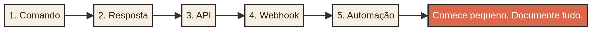

# BotChatBotia Design

### Bots, automação e inteligência artificial com direção humana.

<a href="https://botchatfolio-qxs7htn9.manus.space">Portfólio</a> · <a href="#como-criar-um-bot">Como criar um bot</a> · <a href="OPERACAO.md">Operação</a> · <a href="SECURITY.md">Segurança</a> · <a href="#princípios">Princípios</a>

 <strong>GIFs oficiais do canal GitHub no GIPHY</strong> · <a href="https://giphy.com/GitHub">ver coleção</a>

## O que existe neste perfil 

Este perfil é um espaço público para aprender a criar bots que recebem mensagens, executam tarefas, conectam APIs e devolvem respostas úteis. A proposta é mostrar o processo de forma visual: da ideia ao fluxo, do fluxo à arquitetura, da arquitetura aos testes e da automação à responsabilidade.

> **Este bot também foi construído com apoio de inteligência artificial.** A IA ajuda a explorar ideias, escrever e revisar partes do código, organizar documentação e acelerar protótipos. As decisões, os testes, a validação e a responsabilidade pelo resultado continuam sendo humanas.

## Como criar um bot 

### 1. Comece pelo trabalho, não pela ferramenta

Defina uma tarefa específica: responder uma pergunta frequente, encaminhar uma solicitação, consultar uma API, organizar uma informação ou automatizar uma sequência repetitiva. Um bom primeiro bot é pequeno o suficiente para ser testado e útil o suficiente para ensinar alguma coisa.

### 2. Escolha o canal e a entrada

O bot pode funcionar em um site, Discord, Telegram, WhatsApp, Slack ou em uma interface própria. A entrada pode ser uma mensagem, um comando, um webhook ou um evento agendado. O canal define como o usuário conversa com o bot; a lógica define o que ele faz.

### 3. Separe as partes do sistema

Organize configuração, comandos, validação, serviços externos, tratamento de erros e logs em partes compreensíveis. Nunca coloque tokens no código público. Use variáveis de ambiente e permissões mínimas.

## Arquitetura visual 

Um bot normalmente conecta uma pessoa, um canal, um servidor e serviços externos. A arquitetura não precisa começar grande: ela precisa ser clara. Primeiro faça o caminho funcionar; depois adicione persistência, filas, observabilidade e inteligência quando houver uma razão concreta.

## O papel da inteligência artificial 

A inteligência artificial pode participar de diferentes momentos do desenvolvimento, sem substituir a compreensão do sistema. Ela pode ajudar a gerar alternativas de arquitetura, explicar erros, rascunhar funções, transformar requisitos em checklists, revisar documentação e sugerir testes. O código final deve ser executado, revisado e entendido antes de ser usado.

| Momento | Uso responsável da IA |
| --- | --- |
| Ideia | Explorar possibilidades e delimitar o primeiro experimento. |
| Planejamento | Transformar objetivo em etapas, entradas, saídas e riscos. |
| Implementação | Rascunhar código, explicar APIs e sugerir estruturas. |
| Testes | Propor casos de erro, entradas inesperadas e cenários de limite. |
| Documentação | Organizar instalação, configuração, uso e limitações. |
| Revisão | Encontrar inconsistências, riscos e pontos que precisam de validação humana. |

## Ferramentas e serviços 

As ferramentas abaixo representam categorias usadas para construir e documentar este tipo de projeto. Marcas e serviços devem ser citados como tecnologias utilizadas, nunca como patrocínio ou parceria sem autorização formal.

`Python` · `Node.js` · `TypeScript` · `React` · `APIs` · `Webhooks` · `GitHub` · `Automação` · `Modelos de IA`

As integrações de e-mail, calendário, mensagens e automação devem ser conectadas apenas com autorização da pessoa responsável pela conta. O bot não deve acessar dados privados por padrão, nem agir fora das permissões concedidas.

## Trilha de aprendizado 

| Fase | Resultado esperado |
| --- | --- |
| Bot mínimo | Um comando recebe uma entrada e devolve uma resposta previsível. |
| Código organizado | Configuração, lógica e integrações ficam separadas. |
| API externa | O bot consulta ou envia dados com tratamento de erros. |
| Webhook | Eventos externos iniciam ações de forma segura. |
| Testes | Casos normais, falhas e limites são verificados. |
| Projeto público | README, licença, variáveis de ambiente e instruções ficam claros. |

## Navegação visual do perfil 

<a href="https://botchatfolio-qxs7htn9.manus.space"> <strong>Portfólio</strong></a> ·
<a href="https://github.com/asemoarturriannunespereira-prog/asemoarturriannunespereira-prog/issues"> <strong>Issues</strong></a> ·
<a href="https://github.com/asemoarturriannunespereira-prog/asemoarturriannunespereira-prog/actions"> <strong>Actions</strong></a> ·
<a href="https://github.com/users/asemoarturriannunespereira-prog/projects/1"> <strong>Projects</strong></a> ·
<a href="https://github.com/asemoarturriannunespereira-prog/asemoarturriannunespereira-prog/security/policy"> <strong>Security</strong></a> ·
<a href="OPERACAO.md"> <strong>Operação</strong></a> ·
<a href="SECURITY.md"> <strong>Segurança</strong></a>

Ícones GitHub: <a href="https://www.flaticon.com/br/icone-gratis/github_4494688">Flaticon</a> · GIFs: <a href="https://giphy.com/GitHub">GIPHY/GitHub</a>

