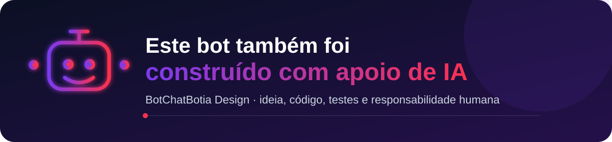
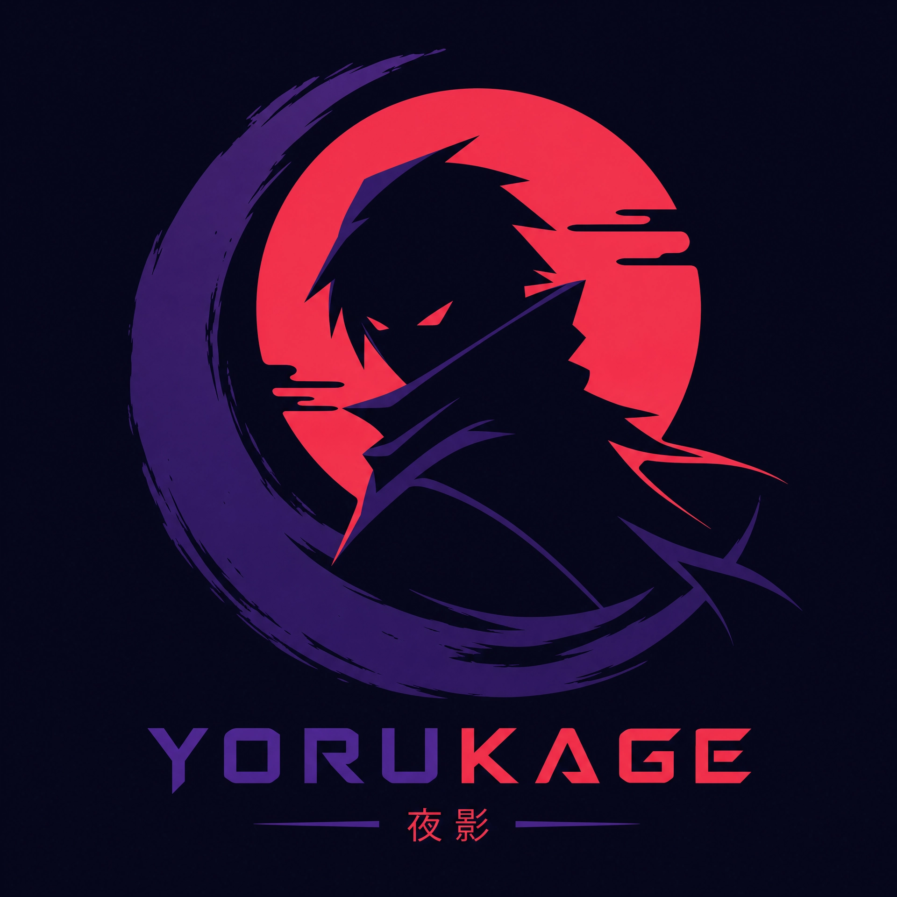
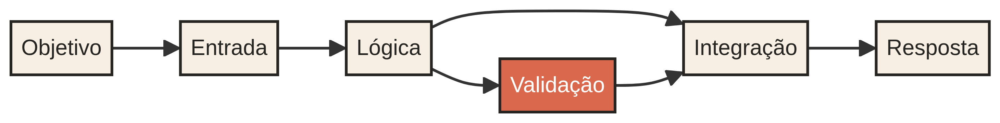
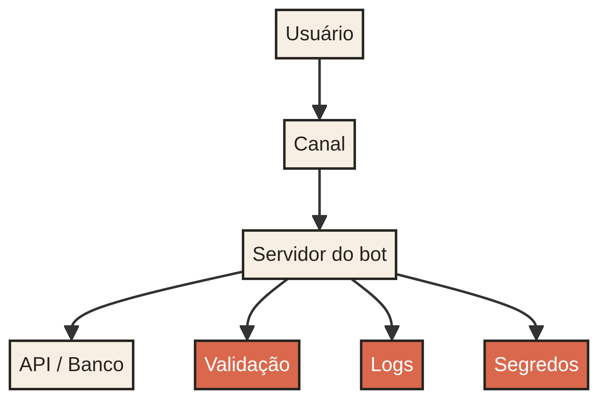

# BotChatBotia Design

### Bots, automação e inteligência artificial com direção humana.

<a href="https://botchatfolio-qxs7htn9.manus.space">Portfólio</a> · <a href="#como-criar-um-bot">Como criar um bot</a> · <a href="OPERACAO.md">Operação</a> · <a href="SECURITY.md">Segurança</a> · <a href="#princípios">Princípios</a>

 <strong>GIFs oficiais do canal GitHub no GIPHY</strong> · <a href="https://giphy.com/GitHub">ver coleção</a>

## O que existe neste perfil 

Este perfil é um espaço público para aprender a criar bots que recebem mensagens, executam tarefas, conectam APIs e devolvem respostas úteis. A proposta é mostrar o processo de forma visual: da ideia ao fluxo, do fluxo à arquitetura, da arquitetura aos testes e da automação à responsabilidade.

> **Este bot também foi construído com apoio de inteligência artificial.** A IA ajuda a explorar ideias, escrever e revisar partes do código, organizar documentação e acelerar protótipos. As decisões, os testes, a validação e a responsabilidade pelo resultado continuam sendo humanas.

## Como criar um bot 

### 1. Comece pelo trabalho, não pela ferramenta

Defina uma tarefa específica: responder uma pergunta frequente, encaminhar uma solicitação, consultar uma API, organizar uma informação ou automatizar uma sequência repetitiva. Um bom primeiro bot é pequeno o suficiente para ser testado e útil o suficiente para ensinar alguma coisa.

### 2. Escolha o canal e a entrada

O bot pode funcionar em um site, Discord, Telegram, WhatsApp, Slack ou em uma interface própria. A entrada pode ser uma mensagem, um comando, um webhook ou um evento agendado. O canal define como o usuário conversa com o bot; a lógica define o que ele faz.

### 3. Separe as partes do sistema

Organize configuração, comandos, validação, serviços externos, tratamento de erros e logs em partes compreensíveis. Nunca coloque tokens no código público. Use variáveis de ambiente e permissões mínimas.

## Arquitetura visual 

Um bot normalmente conecta uma pessoa, um canal, um servidor e serviços externos. A arquitetura não precisa começar grande: ela precisa ser clara. Primeiro faça o caminho funcionar; depois adicione persistência, filas, observabilidade e inteligência quando houver uma razão concreta.

## O papel da inteligência artificial 

A inteligência artificial pode participar de diferentes momentos do desenvolvimento, sem substituir a compreensão do sistema. Ela pode ajudar a gerar alternativas de arquitetura, explicar erros, rascunhar funções, transformar requisitos em checklists, revisar documentação e sugerir testes. O código final deve ser executado, revisado e entendido antes de ser usado.

---

## Identidade visual BotChatBotia 

    

<table align="center">
<tr>
<td align="center" width="50%">

###  Modo claro · Repositório recuperado Baileys

<picture>
  <source media="(prefers-color-scheme: dark)" srcset="https://github-readme-stats.vercel.app/api/pin/?username=asemoarturriannunespereira-prog&repo=baileys-recovered-fork&theme=tokyonight&hide_border=true">
  <source media="(prefers-color-scheme: light)" srcset="https://github-readme-stats.vercel.app/api/pin/?username=asemoarturriannunespereira-prog&repo=baileys-recovered-fork&theme=default&hide_border=true">
  
</picture>

</td>
<td align="center" width="50%">

###  Modo escuro · Estatísticas do perfil

<picture>
  <source media="(prefers-color-scheme: dark)" srcset="https://github-readme-stats.vercel.app/api?username=asemoarturriannunespereira-prog&show_icons=true&theme=tokyonight&hide_border=true">
  <source media="(prefers-color-scheme: light)" srcset="https://github-readme-stats.vercel.app/api?username=asemoarturriannunespereira-prog&show_icons=true&theme=default&hide_border=true">
  
</picture>

</td>
</tr>
</table>

<strong>Paleta e linguagem visual</strong>

| Elemento | Cor | Uso |
|---|---|---|
| Coral Bot | `#FF4D6D` | Bots, destaque e chamada visual |
| Violeta Automação | `#7C3AED` | Workflows, Actions e processos |
| Ciano IA | `#06B6D4` | Inteligência artificial e integrações |
| Laranja Build | `#F97316` | Java, Maven, testes e entregas |
| Grafite | `#0D1117` | Fundo, contraste e leitura no modo escuro |

> **Direção visual:** contraste alto, acentos coloridos e blocos compactos para comunicar criação de bots sem esconder o conteúdo técnico.

 

---

## 🎸 MODO ROCK · BOTS NO PALCO

> **Riffs fortes. Código limpo. Bots que entram em cena.**
>
> Uma identidade visual rock para projetos de automação, WhatsApp e inteligência artificial — com responsabilidade, testes e documentação.

  
  
  

### 🔥 Identidade visual

| Elemento | Direção |
|---|---|
| **Preto palco** | 0D1117 para contraste e profundidade. |
| **Vermelho amplificador** | F85149 para ação, alertas e destaque. |
| **Roxo distorção** | 6E40C9 para IA, automação e experimentação. |
| **Metal grafite** | 30363D para divisores e detalhes técnicos. |

### 🎤 Setlist do perfil

- **Abertura:** conheça a proposta, os bots e a identidade Yorkage.
- **Riff principal:** aprenda fluxos, arquitetura, comandos e integrações.
- **Solo de automação:** explore WhatsApp, botões, tickets e figurinhas.
- **Bis:** consulte estatísticas reais, segurança, Actions e projetos públicos.

### 🤘 Regras do palco

Código público deve ser reproduzível, credenciais ficam fora do repositório, mensagens são enviadas somente com consentimento e toda automação precisa de limites, logs e uma forma clara de desligamento.

<strong>⚡ Gisele Bote · Rock, bots e automação ⚡</strong>

